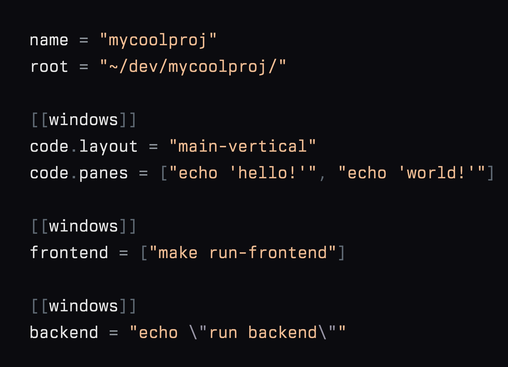

# 🚀 lmux: A Fast Simple Cross Platform tmux Session Manager 🖥️

*lmux = Load tmux*



An open source session manager for tmux, which allows users to manage tmux sessions through simple TOML configuration files, written in Go.

**Why lmux?** 🤔

- ⚡️ Blazingly fast.
  - [Go](https://github.com/golang/go) delivers fast performance and safety.
- 🌎 Cross Platform.
  - Run on Mac, Linux and Windows.
- 🎯 Dead simple.
  - Uses [TOML](https://github.com/toml-lang/toml) for simple configuration.
- 📄 One config = one session.

## Install

### macOS (Homebrew)

```bash
brew install sbcinnovation/tap/lmux
```

### Linux (Debian/Ubuntu and RPM-based)

We publish `.deb` and `.rpm` packages on GitHub Releases. Download the latest from the releases page and install:

```bash
# Debian/Ubuntu
sudo dpkg -i lmux_*.deb || sudo apt -f install

# RHEL/CentOS/Fedora
sudo rpm -i lmux_*.rpm
```

Alternatively, download the tarball from releases and place the `lmux` binary in your `PATH`.

### Windows (Scoop)

```powershell
scoop bucket add sbc https://github.com/sbcinnovation/scoop-bucket
scoop install sbc/lmux
```

### From source (Go 1.22+)

```bash
git clone https://github.com/sbcinnovation/lmux
cd lmux
go build -ldflags "-s -w" -o lmux ./cmd/lmux
sudo mv ./lmux /usr/local/bin/  # or any directory in PATH
```

## Quickstart.

1. Set your favourite editor, ex: `lmux editor zed`.
2. Init a config `lmux init session-name`.
3. Start a config `lmux start session-name`.

## Configuration

On macOS, lmux uses `~/.config/lmux` as the config directory.

- Create a project: `lmux init myproj` (opens in `$EDITOR`)
- Edit a project: `lmux edit myproj`
- List projects: `lmux list`
- Start a project: `lmux start myproj`
- Check environment: `lmux doctor`
- Set or show editor: `lmux editor [value]`

### Editor

- To set the editor globally:
  - `lmux editor nvim`
  - `lmux editor "code -w"`
- To show the current editor: `lmux editor`
- You can also set it on first edit: `lmux edit myproj --editor "nvim"`
- Resolution order when opening files:
  1. saved editor in `~/.config/lmux/settings.toml`
  2. `$EDITOR` (auto-saved on first use)
  3. macOS fallback `open -t` (auto-saved)

### TOML schema (simplified)

```toml
name = "myproj"
root = "~/dev/myproj"
attach = true # default true
tmux_command = "tmux" # optional
tmux_options = "-f ~/.tmux.conf" # parsed but not yet applied
startup_window = "1" # optional, index or name
startup_pane = 1 # optional, pane index

[[windows]]
editor.layout = "main-vertical"
editor.panes = ["vim", "bash"]

[[windows]]
server = "echo \"run your server here\""

[[windows]]
logs = "tail -f /var/log/system.log"

```

Notes:

- Window entries can be:
  - `name = "command"` inside an object in the `windows` array
  - `name = ["cmd1", "cmd2"]` (array of commands) inside an object
  - `name = { layout = L, root = PATH, panes = [...] }`
- Panes accept string (single command), array (multiple commands), or `{ title = commands }`.

## Updates

Check your installed version and optionally check for updates:

```bash
lmux version            # prints version
lmux version --check    # queries GitHub for newer release
lmux version -v         # include build metadata (commit/date)
```

## License

MIT
